# DoctorStats — Entity Relationship Diagram

> Derived from `DoctorStats_Development_Plan.md` (v1.0)
> Core tables from Phase 1 migrations; attributes and supporting entities inferred from Phases 2–9.

---

## Overview

| Entity | Source |
|---|---|
| `users`, `organizations`, `organization_members`, `organization_invitations` | Phase 1–2 |
| `data_files`, `analysis_jobs`, `analysis_job_members`, `analysis_results` | Phase 1, 3–4 |
| `reports`, `report_shares` | Phase 1, 5, 7 |
| `payments`, `subscriptions` | Phase 1, 6 |
| `notifications` | Phase 1, 8 |
| `analysis_columns`, `report_folders`, `report_tags`, `audit_logs` | Inferred from Phases 3, 7, 9 |

---

## Mermaid ER Diagram

```mermaid
erDiagram
    users ||--o{ organization_members : "belongs to"
    users ||--o{ organization_invitations : "sends"
    users ||--o{ analysis_jobs : "creates"
    users ||--o{ analysis_job_members : "granted access"
    users ||--o{ reports : "creates"
    users ||--o{ report_shares : "shares"
    users ||--o{ payments : "makes"
    users ||--o{ subscriptions : "holds (individual)"
    users ||--o{ notifications : "receives"
    users ||--o{ data_files : "uploads"
    users ||--o{ audit_logs : "performs"
    users ||--o| organizations : "administers"

    organizations ||--o{ organization_members : "has"
    organizations ||--o{ organization_invitations : "issues"
    organizations ||--o{ analysis_jobs : "owns"
    organizations ||--o{ reports : "owns"
    organizations ||--o{ data_files : "stores"
    organizations ||--o{ subscriptions : "holds (org plan)"
    organizations ||--o{ payments : "billed to"
    organizations ||--o{ report_folders : "organises"
    organizations ||--o{ report_tags : "defines"

    organization_members }o--|| users : "user"
    organization_members }o--|| organizations : "organization"

    organization_invitations }o--|| organizations : "for"
    organization_invitations }o--|| users : "invited_by"

    data_files }o--|| users : "uploaded_by"
    data_files }o--o| organizations : "org_context"
    data_files ||--o| analysis_jobs : "source_for"

    analysis_jobs }o--|| users : "created_by"
    analysis_jobs }o--o| organizations : "org_context"
    analysis_jobs }o--|| data_files : "uses"
    analysis_jobs }o--o| payments : "paid_via"
    analysis_jobs }o--o| subscriptions : "covered_by"
    analysis_jobs ||--o{ analysis_job_members : "restricted_to"
    analysis_jobs ||--o{ analysis_columns : "describes"
    analysis_jobs ||--o{ analysis_results : "produces"
    analysis_jobs ||--o| reports : "generates"

    analysis_job_members }o--|| analysis_jobs : "job"
    analysis_job_members }o--|| users : "member"

    analysis_columns }o--|| analysis_jobs : "belongs_to"

    analysis_results }o--|| analysis_jobs : "belongs_to"

    reports }o--|| analysis_jobs : "from_job"
    reports }o--|| users : "created_by"
    reports }o--o| organizations : "org_context"
    reports }o--o| report_folders : "in_folder"
    reports ||--o{ report_shares : "shared_via"
    reports }o--o{ report_tags : "tagged_with"

    report_folders }o--o| organizations : "org_shared"
    report_folders }o--o| users : "personal"

    report_shares }o--|| reports : "report"
    report_shares }o--|| users : "shared_by"
    report_shares }o--o| users : "recipient"
    report_shares }o--o| organizations : "org_scope"

    payments }o--|| users : "payer"
    payments }o--o| organizations : "org_context"
    payments }o--o| analysis_jobs : "for_job"
    payments }o--o| subscriptions : "for_subscription"

    subscriptions }o--o| users : "individual_plan"
    subscriptions }o--o| organizations : "org_plan"
    subscriptions ||--o{ payments : "renewed_by"

    notifications }o--|| users : "recipient"

    audit_logs }o--|| users : "actor"
    audit_logs }o--o| organizations : "org_context"

    users {
        bigint id PK
        string email UK
        string password
        string name
        enum account_type "individual | organizational"
        enum status "active | deactivated"
        timestamp email_verified_at
        timestamp created_at
        timestamp updated_at
    }

    organizations {
        bigint id PK
        string name
        bigint admin_user_id FK
        json branding_settings "Enterprise only"
        timestamp created_at
        timestamp updated_at
    }

    organization_members {
        bigint id PK
        bigint organization_id FK
        bigint user_id FK
        enum role "admin | analyst | viewer"
        enum status "active | pending_invitation | inactive"
        timestamp joined_at
        timestamp created_at
        timestamp updated_at
    }

    organization_invitations {
        bigint id PK
        bigint organization_id FK
        bigint invited_by FK
        string email
        string token UK
        enum role "admin | analyst | viewer"
        timestamp expires_at
        enum status "pending | accepted | expired"
        timestamp created_at
        timestamp updated_at
    }

    data_files {
        bigint id PK
        bigint user_id FK
        bigint organization_id FK "nullable"
        string original_filename
        string s3_path
        enum format "xlsx | xls | csv"
        int file_size_bytes
        string sheet_name "nullable, Excel"
        enum virus_scan_status "pending | clean | rejected"
        timestamp created_at
        timestamp updated_at
    }

    analysis_jobs {
        bigint id PK
        string job_id UK "public unique ID"
        bigint user_id FK
        bigint organization_id FK "nullable"
        bigint data_file_id FK
        text objectives
        enum status "pending | processing | completed | failed"
        enum access_scope "all_members | specific_members | private"
        enum payment_method "pay_per_job | subscription"
        bigint payment_id FK "nullable"
        bigint subscription_id FK "nullable"
        timestamp submitted_at
        timestamp completed_at
        timestamp created_at
        timestamp updated_at
    }

    analysis_job_members {
        bigint id PK
        bigint analysis_job_id FK
        bigint user_id FK
        timestamp created_at
    }

    analysis_columns {
        bigint id PK
        bigint analysis_job_id FK
        string column_name
        int column_index
        enum data_type "categorical | numerical | date | text"
        string description
        string unit_of_measurement "nullable"
        enum variable_type "independent | dependent | control | identifier | excluded"
        json quality_warnings "nullable"
        timestamp created_at
        timestamp updated_at
    }

    analysis_results {
        bigint id PK
        bigint analysis_job_id FK
        string test_name
        string test_category
        json parameters
        decimal test_statistic "nullable"
        decimal p_value "nullable"
        json confidence_intervals
        json effect_sizes
        json assumptions_validation
        json raw_output
        timestamp created_at
        timestamp updated_at
    }

    reports {
        bigint id PK
        bigint analysis_job_id FK
        bigint user_id FK
        bigint organization_id FK "nullable"
        bigint report_folder_id FK "nullable"
        string title
        text executive_summary
        text ai_interpretation
        string web_html_path
        string pdf_path
        string excel_path
        boolean is_favourite
        enum status "draft | published | archived"
        timestamp created_at
        timestamp updated_at
    }

    report_folders {
        bigint id PK
        bigint user_id FK "nullable"
        bigint organization_id FK "nullable"
        string name
        boolean is_shared "org-wide"
        timestamp created_at
        timestamp updated_at
    }

    report_tags {
        bigint id PK
        bigint user_id FK "nullable"
        bigint organization_id FK "nullable"
        string name
        timestamp created_at
    }

    report_shares {
        bigint id PK
        bigint report_id FK
        bigint shared_by FK
        bigint recipient_user_id FK "nullable"
        bigint organization_id FK "nullable, org internal"
        enum share_method "secure_link | email | org_internal | external"
        string token UK "nullable"
        string password_hash "nullable"
        string recipient_email "nullable"
        timestamp expires_at "nullable"
        timestamp created_at
        timestamp updated_at
    }

    payments {
        bigint id PK
        bigint user_id FK
        bigint organization_id FK "nullable"
        bigint analysis_job_id FK "nullable"
        bigint subscription_id FK "nullable"
        string zoho_payment_id UK
        decimal amount
        string currency
        enum status "pending | succeeded | failed | refunded"
        enum payment_type "pay_per_job | subscription | renewal"
        string invoice_number "nullable"
        timestamp paid_at
        timestamp created_at
        timestamp updated_at
    }

    subscriptions {
        bigint id PK
        bigint user_id FK "nullable, individual"
        bigint organization_id FK "nullable, org"
        enum plan_tier "basic | professional | enterprise | org_basic | org_professional | org_enterprise"
        enum billing_cycle "monthly | annual"
        enum status "active | cancelled | expired | past_due"
        int analyses_used_this_period
        int member_limit "org plans"
        boolean auto_renew
        string zoho_subscription_id UK
        timestamp starts_at
        timestamp ends_at
        timestamp created_at
        timestamp updated_at
    }

    notifications {
        bigint id PK
        bigint user_id FK
        enum type "analysis_complete | payment | invitation | share | system"
        string title
        text message
        json data "nullable"
        timestamp read_at "nullable"
        timestamp created_at
        timestamp updated_at
    }

    audit_logs {
        bigint id PK
        bigint user_id FK "nullable"
        bigint organization_id FK "nullable"
        string action
        string entity_type
        bigint entity_id
        json metadata
        string ip_address
        timestamp created_at
    }
```

---

## Relationship Summary

| Relationship | Cardinality | Notes |
|---|---|---|
| User ↔ Organization | M:N via `organization_members` | Roles: Admin, Analyst, Viewer |
| Organization → User (admin) | 1:1 | Creator is initial admin |
| Organization → Invitation | 1:N | Tokenised email invites with expiry |
| User → Analysis Job | 1:N | Creator; org jobs belong to org |
| Analysis Job → Data File | N:1 | One source file per job |
| Analysis Job → Members | M:N via `analysis_job_members` | Only when access = specific members |
| Analysis Job → Results | 1:N | One row per statistical test |
| Analysis Job → Report | 1:1 | One assembled report per completed job |
| Report → Shares | 1:N | Secure link, email, org, or public |
| User/Org → Subscription | 1:1 active | Individual vs org plans are mutually exclusive contexts |
| Analysis Job → Payment/Subscription | N:1 | Pay-per-job or subscription usage |
| User → Notifications | 1:N | Email + in-app |

---

## Design Notes

1. **Org data isolation** — `organization_id` on jobs, files, reports, and payments enforces the org-scoped access described in Phases 2 and 9.
2. **Access control** — `analysis_jobs.access_scope` plus `analysis_job_members` implements the wizard step "all members / specific members / private" (Phase 3).
3. **Column metadata** — Stored in `analysis_columns` rather than JSON on the job, matching the per-column mapping UI (Phase 3).
4. **Subscription constraint** — Org members cannot use personal subscriptions for org analyses (Phase 6); enforced at application layer via `subscriptions.user_id` vs `subscriptions.organization_id`.
5. **Inferred tables** — `analysis_columns`, `report_folders`, `report_tags`, and `audit_logs` are not listed in Phase 1 migrations but are implied by Phases 3, 7, and 9.

---

*ERD based on DoctorStats Development Plan v1.0*
